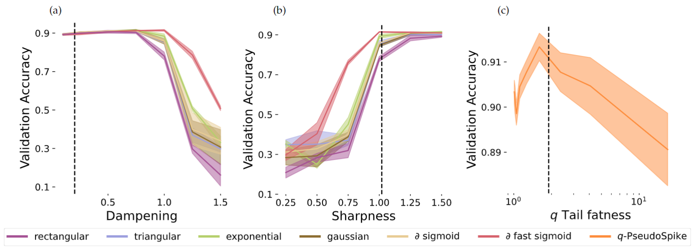

# Stabilizing Spiking Neuron Training

This is the official repository of the [Stabilizing Spiking Neuron Training](https://arxiv.org/abs/2202.00282) 
article, submitted to IEEE.




The scripts and folders mentioned in the following can be found inside ```stable_spike/src/stablespike```.
Run the codes after doing ```pip install -r requirements.txt```. You can install
it as a package with ```pip install git+https://github.com/LuCeHe/stable_spike```.
The experiments for the last two tables require minor modifications of the repositories
of the article [Synaptic Plasticity Dynamics for Deep Continuous Local Learning (DECOLLE)](https://www.frontiersin.org/articles/10.3389/fnins.2020.00424/full)
whose original code can be found [here](https://github.com/nmi-lab/decolle-public), and of the article
[Fluctuation-driven initialization for spiking neural network training](https://iopscience.iop.org/article/10.1088/2634-4386/ac97bb)
whose original code can be found [here](https://github.com/fmi-basel/stork).
For simplicity, and in case their code evolves in the future, we copied their code
in this repository, adding our minor modifications, 
since it could avoid future incompatibilities.

Figure 1 can be generated running ```plot_sgs.py```. To generate the experiments
for Figure 2, run as one line

```
python training.py with task_name=##x## net_name=##y## seed=##s##
     epochs=None steps_per_epoch=None batch_size=None stack=None n_neurons=None 
     lr=##z## comments=embproj_nogradreset_timerepeat:2_##w## 
```


where ```##x##``` should be changed by one of the following three tasks ```wordptb```, ```heidelberg```, ```sl_mnist```,
```##y##``` by one of the following three networks ```maLIF``` for the LIF, 
```maLSNN``` for the ALIF and ```spikingLSTM```, the seed ```##s##``` always from ```[0, 1, 2, 3]```,
```##z##``` by one of the learning rates in the list ```[1e-5, 3.16e-5, 1e-4, 3.16e-4, 1e-3, 3.16e-3, 1e-2]```, 
and ```##w##``` is used to specify the Surrogate Gradient (SG) shape, and should be changed by one of the following 
```cappedskippseudod``` for the rectangular SG, ```originalpseudod``` for the triangular,
```exponentialpseudod``` for the exponential,```gaussianpseudod``` for the gaussian, 
```sigmoidalpseudod``` for the derivative of the sigmoid, 
```fastsigmoidpseudod``` for the derivative of the fast sigmoid.


For Figure 3, run 

```
python training.py with task_name=heidelberg net_name=maLSNN seed=##s##
     epochs=None steps_per_epoch=None batch_size=None stack=None n_neurons=None lr=None
     comments=noalif_nogradreset_multreset2_dropout:.3_timerepeat:2_annealing_v0m_adjfi:##x##_adjff:.01 
```

replacing ```##x##``` by one in ```[0.01, 0.1, 0.3, 0.5,  0.7, 0.9, 0.99]```, where ```adjfi``` 
stands for adjust the initial firing rate while ```adjff``` stands for adjust the final firing rate.


For Figure 4, run

```
python training.py with task_name=heidelberg net_name=maLSNN seed=##s##
     epochs=None steps_per_epoch=None batch_size=None stack=None n_neurons=None lr=None
     comments=noalif_exponentialpseudod_##x## 
```

with ```##x##``` as one of these strings: ```conditionI```, 
```conditionII```, 
```conditionIII```, 
```conditionIV```, 
```conditionI_conditionII```, 
```conditionI_conditionII_conditionIII``` or
```conditionI_conditionII_conditionIII_conditionIV```.


Figure 5, for the color curves, run

```
python training.py with task_name=heidelberg net_name=maLSNN 
     epochs=None steps_per_epoch=None batch_size=None stack=None n_neurons=None 
     lr=None comments=embproj_noalif_nogradreset_timerepeat:2_##w## 
```

where for the left panel, you change ```##w##``` by one of the SG flags mentioned above
followed by ```dampf:##x##``` where ```##x##``` is in ```[0.25, 0.5, 0.75, 1.0, 1.25, 1.5]```,
and for the central panel you follow the same ```##w##``` by ```sharpn:##x##```
where ```##x##``` is in ```[0.25, 0.5, 0.75, 1.0, 1.25, 1.5]```. Instead for the right panel
you change ```##w##``` by ```ntailpseudod_tailvalue:##x##``` with the tail fatness ```##x##```
in ```[1.0100, 1.0226, 1.0514, 1.1165, 1.2643, 1.5994, 2.3593, 4.0823, 7.9894, 16.8489]```.

For the dashed line run 

```
python training.py with task_name=heidelberg net_name=maLSNN 
     epochs=None steps_per_epoch=None batch_size=None stack=None n_neurons=None 
     lr=None comments=embproj_noalif_nogradreset_timerepeat:2_conditionIII 
     
python training.py with task_name=heidelberg net_name=maLSNN 
     epochs=None steps_per_epoch=None batch_size=None stack=None n_neurons=None 
     lr=None comments=embproj_noalif_nogradreset_timerepeat:2_exponentialpseudod_conditionIV 
     
python training.py with task_name=heidelberg net_name=maLSNN 
     epochs=None steps_per_epoch=None batch_size=None stack=None n_neurons=None 
     lr=None comments=embproj_noalif_nogradreset_timerepeat:2_ntailpseudod_conditionIV_optimizetail 
```

The first will save the predicted dampening factor in the results, the second the predicted sharpness, 
and the third one the predicted tail fatness.


To reproduce Table 1, run

```
python decolle/scripts/main_decolle.py --datasetname=dvs --seed=##s##
     --comments=##x## 
```

replacing the seed ```##s##``` as before, and
```##x##``` by ```frcontrol_frfrom:0.158_lmbd:100_switchep:1``` for the 0.158 case,
by ```frcontrol_frfrom:0.5_lmbd:100_switchep:1``` for the 0.5 case, and keeping it empty for the
default setting.

To reproduce Table 2, run

```
python fluctuations/examples/main_fluctuations.py --dataset=##d## --seed=##s##
     --epochs=-1 --comments=##x## 
```

replacing the seed as before, ```##d##``` by one of ``` [dvs, shd, cifar10]```, and 
```##x##``` by one in ```[shallow, deep]``` followed by either ```[_lr:##y##, _muchange_lr:##y##, _muchange_nu:1_eps:1_lr:##y##]```,
where the optimal learning rate ```##y##``` found on the default settings was 0.05 for SHD, 
and for DVS and CIFAR10 was 0.0005.
